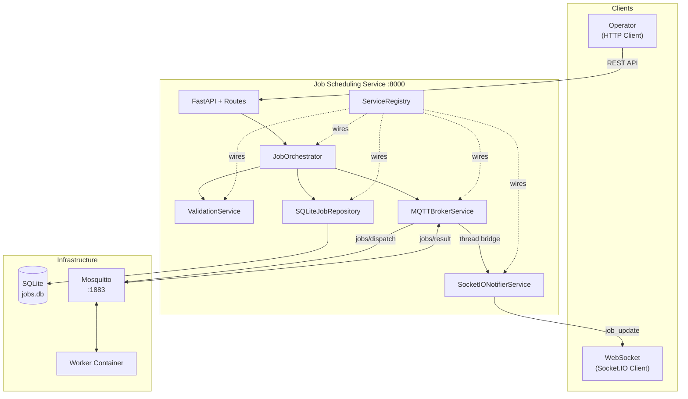
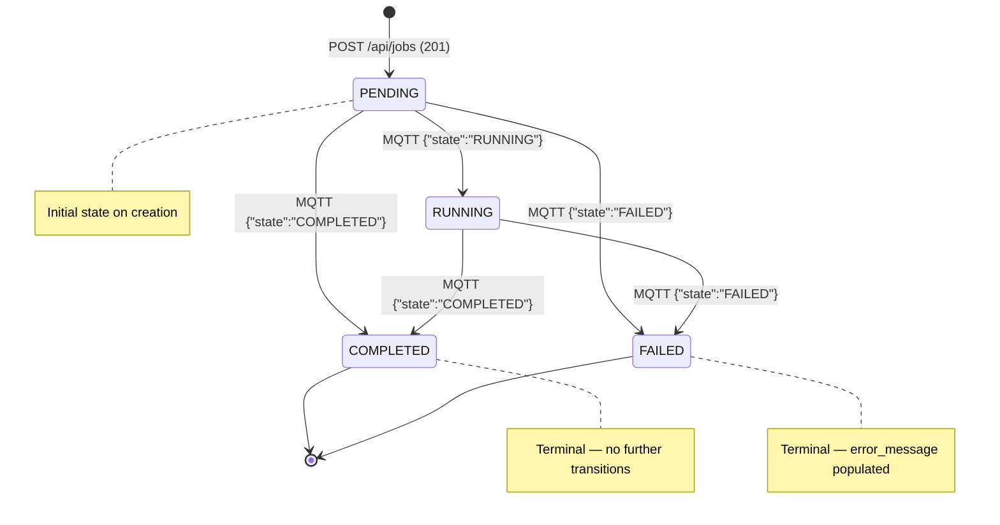
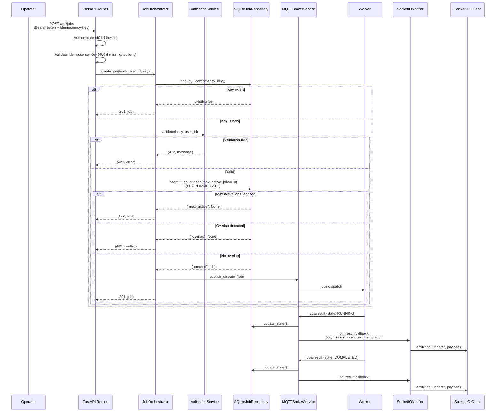
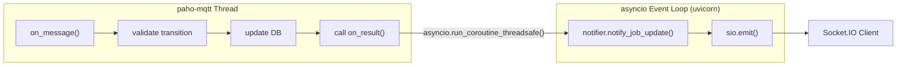
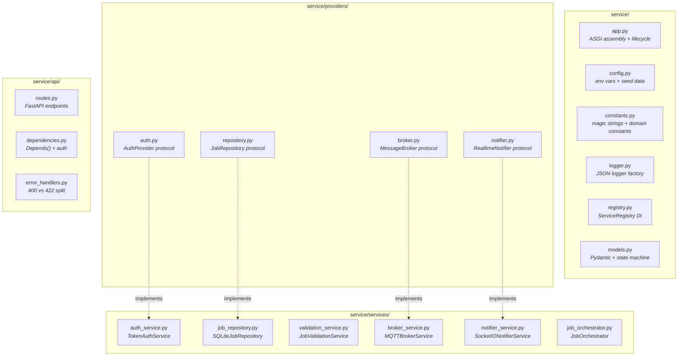

# Job Scheduling API

Backend service for scheduling and tracking operations on physical assets.
Exposes an HTTP REST API, coordinates with a worker over MQTT, and pushes
real-time state updates to clients over Socket.IO.

## How to Run

### Prerequisites

- Python 3.10+
- Docker (for Mosquitto broker and worker)

### Full-Stack Startup

```bash
# 1. Boot the MQTT broker and worker
docker compose up -d

# 2. Install Python dependencies
make setup

# 3. Start the service (port 8000)
make run

# 4. Run the self-assessment harness (in a separate terminal)
make verify

# 5. Run the unit/integration tests (service must be running)
make test
```

### Individual Commands

```bash
pip install -r requirements.txt          # install deps
python -m service.app                    # start service
python3 verify.py                        # run verify harness
pytest tests/ -v                         # run tests
```

### macOS Troubleshooting: Mosquitto / Docker Desktop

On macOS (especially Apple Silicon), Docker Desktop may exhibit networking
issues where the host cannot connect to `localhost:1883` inside the
Mosquitto container. Common fixes:

1. **IPv6 conflict** -- Docker Desktop may bind Mosquitto on IPv6 only.
   Add `socket_domain ipv4` to `mosquitto.conf`:
   ```
   listener 1883 0.0.0.0
   socket_domain ipv4
   allow_anonymous true
   ```
2. **Apple Silicon (ARM64)** -- Force the platform in `docker-compose.yml`:
   ```yaml
   mosquitto:
     image: eclipse-mosquitto:2
     platform: linux/amd64
   ```
3. **Firewall** -- Ensure macOS does not block port 1883. Check with:
   ```bash
   lsof -i :1883
   ```
4. **Docker Desktop restart** -- If none of the above work, restart
   Docker Desktop entirely. The VM networking layer can get stale.

---

## Architecture

The service follows a **registry-based provider-service architecture**
built on SOLID principles. Provider protocols define contracts; concrete
service classes implement them; a central `ServiceRegistry` wires
everything at startup.

### System Overview



### Job Lifecycle (State Machine)



### Request Flow: Job Submission



### MQTT ↔ Socket.IO Threading Bridge



### Package Layout



---

## Database Choice

**SQLite** with WAL (Write-Ahead Logging) mode.

**Why:** The exercise scope is a single-process service with one domain
table. SQLite requires zero infrastructure beyond a file, has excellent
read concurrency in WAL mode, and its write serialization is exactly what
the overlap check needs. In production with multiple processes or
horizontal scaling, I would use PostgreSQL with `SELECT ... FOR UPDATE`
or advisory locks.

## Concurrency Strategy

The overlap check uses **`BEGIN IMMEDIATE`**, which SQLite documents as
acquiring the reserved (write) lock at transaction start, not at the
first write statement. This means:

1. Thread A begins a transaction with `BEGIN IMMEDIATE`.
2. Thread B tries `BEGIN IMMEDIATE` and **blocks** (up to `busy_timeout`).
3. Thread A checks the active-job count, checks for overlaps, inserts the job, and commits.
4. Thread B unblocks, runs its checks, and **sees Thread A's committed row**.
5. Thread B rolls back with a 409.

Both the **active-job limit** (max 10) and the **overlap check** run
inside the same `BEGIN IMMEDIATE` transaction, guaranteeing atomicity
for both constraints under concurrent load. The `verify.py` concurrency
test (10 parallel requests) passes consistently.

A composite index on `(asset_id, state, start_time, end_time)` covers
the overlap query to avoid full table scans at scale.

**Why not `asyncio.Lock`?** That only serializes within a single event
loop. `BEGIN IMMEDIATE` works at the database level, which is correct
regardless of how uvicorn schedules threads (sync route handlers run in
a thread pool).

## Idempotency Strategy

The `idempotency_key` column has a `UNIQUE(user_id, idempotency_key)`
constraint, scoped per user as the spec requires.

On `POST /api/jobs`, the orchestrator first queries:
```sql
SELECT * FROM jobs WHERE user_id = ? AND idempotency_key = ?
```
If a row exists, it returns the existing job with 201 -- no new row is
created. If not, it proceeds to the overlap check and insert within the
`BEGIN IMMEDIATE` transaction.

The key lives in the same `jobs` table (no separate idempotency store).
The first request's body is canonical; the spec says replay body matching
is not required.

## MQTT & Socket.IO Threading

This is the main concurrency boundary in the application:

- **paho-mqtt** runs its network loop in a **background OS thread**
  (`client.loop_start()`). All MQTT callbacks (`on_message`, `on_connect`)
  execute in this thread.
- **Socket.IO** (python-socketio AsyncServer) runs on the **asyncio event
  loop** managed by uvicorn.

When an MQTT result arrives, the broker service validates the state
transition and updates the database (synchronous SQLite -- safe from any
thread). It then calls the result callback registered by `app.py`, which
bridges to asyncio:

```python
future = asyncio.run_coroutine_threadsafe(
    notifier.notify_job_update(user_id, payload), loop
)
try:
    future.result(timeout=5)
except Exception:
    log.exception("failed to emit job_update")
```

`run_coroutine_threadsafe` schedules the coroutine on the main event loop
and returns a `concurrent.futures.Future`. Calling `.result()` blocks the
paho thread until the emit completes, ensuring the Socket.IO message is
delivered before the next MQTT message is processed. The `try/except`
ensures a failed emit never crashes paho's background thread.

## Trade-Offs

**What I cut for the time budget:**
- The `on_event("startup"/"shutdown")` pattern is deprecated in FastAPI;
  a lifespan context manager would be cleaner but requires restructuring
  the Socket.IO mount order.
- No pagination on `GET /api/jobs` -- fine for the exercise, would need
  cursor-based pagination in production.
- Tests hit the live service (no in-process test client) -- simpler and
  more honest, but requires `docker compose up` first.

**What I would build next:**
- PostgreSQL backend (swap the repository implementation via the registry)
- Request-level structured logging middleware (correlation IDs)
- OpenAPI schema documentation for the job endpoints
- Rate limiting per user
- Pagination + filtering on the job listing endpoint

## AI Tools Disclosure

Cursor with Claude was used throughout development. The AI generated
initial boilerplate (FastAPI route structure, Pydantic models, SQLite
schema, paho-mqtt client setup, ServiceRegistry skeleton) and
documentation drafts (README diagrams, implementation guide HTML).
Manual work included: designing the `BEGIN IMMEDIATE` overlap-detection
transaction, debugging the `await sio.enter_room()` issue (was missing
`await`, causing Socket.IO rooms to never be assigned), structuring the
provider-service-registry architecture, writing the constants module to
eliminate all magic values, driving multiple audit and hardening passes
(response field leakage, concurrent idempotency races, atomic
active-job limits, MQTT callback thread safety), and iterative testing
against `verify.py` until 23/23 passed.
